<div align="center">

<!-- Animated gradient wave banner - music themed colors -->


<!-- Animated typing subtitle -->


<br/>

<p align="center">
  
  
  
  
</p>

<p align="center">
  
  
  
  
</p>

<p align="center">
  <a href="https://ayeshajavid91-star.github.io/MelodyForge/">
    
  </a>
</p>

</div>

<div align="center">

</div>

<br/>

<!-- Animated audio wave gif -->
<div align="center">

</div>

<br/>

## 📚 Table of Contents

<div align="center">

| 🎼 [Overview](#-project-overview) | ✨ [Features](#-features) | 🛠️ [Tech Stack](#️-tech-stack) | ⚙️ [How It Works](#️-how-it-works) |
|:---:|:---:|:---:|:---:|
| ▶️ [Run It](#️-how-to-run) | 📂 [Structure](#-project-structure) | 🎚️ [Mood Engine](#️-mood-engine) | 🗺️ [Roadmap](#️-roadmap) |
| 🤝 [Contributing](#-contributing) | 👤 [Author](#-author) | 📄 [License](#-license) | |

</div>

---

## 📌 Project Overview


**MelodyForge** is a two-part sonic experiment:

🎼 **1. AI Music Generator** — an **LSTM deep learning model** trained on preprocessed MIDI sequences, learning musical patterns note by note to compose brand-new original piano pieces.

🌊 **2. Ambient Soundscape Generator** — a **browser-based synthesizer** that generates mood-driven ambient audio (**Focus / Relax / Energetic**) live using the **Web Audio API** — every sound is generated in real time, nothing is pre-recorded.

> 💡 One half learns from centuries of composed music. The other half never plays the same soundscape twice.

<br clear="right"/>

---

## ✨ Features

<table>
<tr>
<td width="50%" valign="top">

### 🧠 AI Music Generation
- Parses MIDI files into note/chord sequences via `music21`
- Numeric encoding of notes for model input
- **LSTM architecture** — Embedding → LSTM → Dense
- Generates entirely new, original note sequences
- Exports directly to a playable **`.mid`** file

</td>
<td width="50%" valign="top">

### 🌊 Ambient Soundscape Engine
- Three moods: **Focus 🎯 · Relax 🌙 · Energetic ⚡**
- Unique frequency, waveform & tempo per mood
- **Real-time synthesis** — evolves with subtle randomness
- Live **radial visualizer** reacting to generated audio
- 100% client-side — zero audio files, zero server

</td>
</tr>
</table>

---

## 🛠️ Tech Stack

<div align="center">

| Layer | Technology | Badge |
|:---|:---|:---:|
| **Model Training** | Python, TensorFlow/Keras |  |
| **MIDI Parsing** | music21 |  |
| **Sequence Model** | LSTM Neural Network |  |
| **Web Synthesis** | Web Audio API |  |
| **Frontend** | HTML, CSS, JavaScript |  |
| **Training Environment** | Google Colab |  |

</div>

---

## ⚙️ How It Works

```mermaid
flowchart TB
    subgraph AI["🎼 AI Music Generation"]
    A1[🎹 MIDI Dataset] --> A2[🔤 Note/Chord Parsing - music21]
    A2 --> A3[🔢 Numeric Encoding]
    A3 --> A4[🧠 LSTM Training]
    A4 --> A5[🎶 New Sequence Generated]
    A5 --> A6[💾 Export as .mid]
    end

    subgraph AMB["🌊 Ambient Soundscape"]
    B1[🎯 Mood Selected] --> B2[🎛️ Frequency + Waveform Profile]
    B2 --> B3[🔊 Web Audio Oscillators]
    B3 --> B4[✨ Continuous Evolving Layers]
    B4 --> B5[📊 Live Radial Visualizer]
    end

    style A4 fill:#5A189A,stroke:#000,color:#fff
    style A6 fill:#C77DFF,stroke:#000,color:#000
    style B3 fill:#F72585,stroke:#000,color:#fff
    style B5 fill:#E0AAFF,stroke:#000,color:#000
```

<div align="center">



</div>

<table>
<tr><th colspan="2">🎼 Music Generation Pipeline</th></tr>
<tr><td>1️⃣</td><td>MIDI files are parsed into note/chord sequences</td></tr>
<tr><td>2️⃣</td><td>Sequences are encoded numerically for model input</td></tr>
<tr><td>3️⃣</td><td>An LSTM network learns to predict the next note from prior context</td></tr>
<tr><td>4️⃣</td><td>The trained model generates a new sequence → exported as <code>.mid</code></td></tr>
</table>

<table>
<tr><th colspan="2">🌊 Soundscape Synthesis Pipeline</th></tr>
<tr><td>1️⃣</td><td>A mood is selected — Focus, Relax, or Energetic</td></tr>
<tr><td>2️⃣</td><td>Web Audio API generates oscillator tones matching that mood's profile</td></tr>
<tr><td>3️⃣</td><td>New notes layer in continuously with slight variation — never repeats</td></tr>
</table>

---

## 🎚️ Mood Engine

<div align="center">

| Mood | Icon | Vibe | Waveform | Tempo |
|:---|:---:|:---|:---:|:---:|
| **Focus** | 🎯 | Steady, minimal, clear-headed | Sine | Slow |
| **Relax** | 🌙 | Warm, drifting, low-frequency | Triangle | Very Slow |
| **Energetic** | ⚡ | Bright, layered, driving | Sawtooth | Fast |

</div>

---

## ▶️ How to Run

### 🎧 Ambient Soundscape App — Instant, No Install

<div align="center">

[](https://ayeshajavid91-star.github.io/MelodyForge/)

</div>

Or run it locally:

```bash
# 1️⃣ Clone the repository
git clone https://github.com/ayeshajavid91-star/MelodyForge.git

# 2️⃣ Move into the project folder
cd MelodyForge

# 3️⃣ Open in your browser
open index.html      # macOS
start index.html      # Windows
```

### 🧠 Train the AI Music Model

<table>
<tr><td>1️⃣</td><td>Open <a href="https://colab.research.google.com">Google Colab</a></td></tr>
<tr><td>2️⃣</td><td>Upload <code>AI_Music_Generator_Training.ipynb</code></td></tr>
<tr><td>3️⃣</td><td>Add <code>.mid</code> files to a <code>midi_dataset</code> folder (e.g. Classical Piano MIDI dataset on Kaggle)</td></tr>
<tr><td>4️⃣</td><td>Run all cells (<i>Runtime → Run all</i>)</td></tr>
<tr><td>5️⃣</td><td>Download the generated <code>.mid</code> output</td></tr>
</table>

<div align="center">


</div>

---

## 📂 Project Structure

```
MelodyForge/
├── 🧠 AI_Music_Generator_Training.ipynb   # LSTM model training notebook
├── 🌐 index.html                          # Ambient soundscape web app
├── 🎵 generated_music.mid                 # Sample AI-generated output
├── 💾 music_lstm_model.h5                 # Trained LSTM model
└── 📖 README.md                           # You are here
```

---

## 🗺️ Roadmap

- [x] LSTM-based MIDI music generation
- [x] Real-time Web Audio ambient synth
- [x] Mood-based soundscape presets
- [ ] Export soundscape sessions as audio files
- [ ] Add Transformer-based music generation option
- [ ] Custom mood builder (user-defined frequencies)
- [ ] Mobile-optimized visualizer

---

## 🤝 Contributing

Contributions, issues, and feature ideas are welcome for discussion — please reach out to the author first, as this repository is **All Rights Reserved** (see [License](#-license)).

<div align="center">

</div>

---

## 🏷️ Suggested GitHub Topics

<div align="center">

`python` • `deep-learning` • `lstm` • `music-generation` • `web-audio-api` • `javascript` • `midi` • `generative-art`

</div>

---

## 👤 Author

<div align="center">


### **Ayesha Javid**

<a href="https://github.com/ayeshajavid91-star"></a>
<a href="mailto:ayeshajavid91@gmail.com"></a>

</div>

---

## 📄 License

**All Rights Reserved.**

This project and its source code are the intellectual property of the author. No part of this repository — including the code, design, or documentation — may be copied, modified, distributed, used, or reproduced in any form without the explicit written permission of the author.

© 2026 Ayesha Javid. Unauthorized use is strictly prohibited.

📧 For permissions or licensing inquiries, contact: **ayeshajavid91@gmail.com**

---

<div align="center">


<sub>🎵 If this project struck a chord with you, consider giving it a star! ⭐</sub>
</div>
